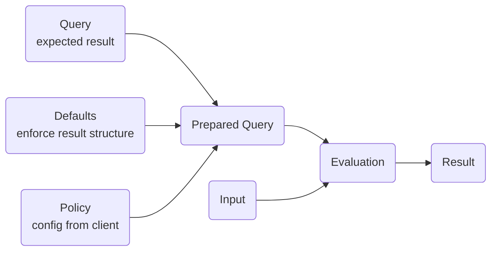

# Example Open Policy Agent + Golang

```mermaid
flowchart LR
      Q(Query\nexpected result) --> PQ(Prepared Query)
      D(Defaults\nenforce result structure) --> PQ
      P(Policy\nconfig from client) --> PQ
      PQ --> E(Evaluation)
      I(Input) --> E

      E --> R(Result)
```
